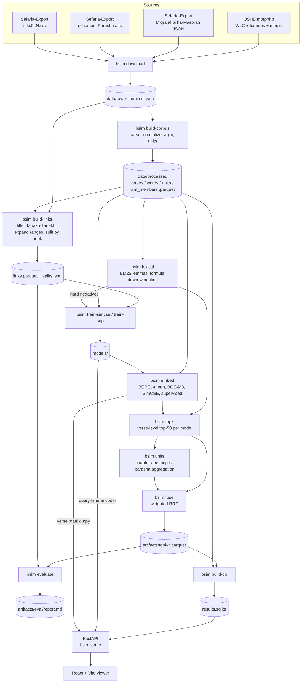

# Architecture — bible-similarity

## 1. Goal & scope

For every unit of the Hebrew Bible (Tanakh), compute the **top-k most similar units of the same type**, under three similarity modes, and browse the results in a local web viewer.

| Unit type | Count (approx.) | Compared against |
|---|---|---|
| Verse | ~23,200 | all verses in Tanakh |
| Chapter | 929 | all chapters in Tanakh |
| Pericope (Masoretic *petucha/setuma* section) | ~2–5k | all pericopes in Tanakh |
| Parasha | 54 | other parashiyot (Torah only) |

| Mode | Meaning | Signal |
|---|---|---|
| `lexical` | shared wording | BM25 / TF-IDF over OSHB lemmas |
| `semantic` | shared meaning / theme / parallel | fine-tuned BEREL 3.0 sentence embeddings |
| `fused` | both | weighted Reciprocal Rank Fusion of the two |

Hebrew only (no translations). Personal/research use. Everything runs locally on a single **GTX 1080 Ti (11 GB, Pascal)**.

## 2. System overview



The system has two halves:

1. **Offline pipeline** (Python, `bsim` CLI): deterministic, stage-by-stage, each stage reads files written by earlier stages and writes its own artifacts. Any stage can be re-run independently.
2. **Online viewer**: FastAPI reads `results.sqlite` (precomputed matches) plus the verse embedding matrix and the final encoder (for free-text search and on-demand compare). React SPA talks to it over JSON.

## 3. Repository layout

```
bible-similarity/
├── README.md
├── CLAUDE.md
├── pyproject.toml / uv.lock        # uv-managed; torch from the cu126 index
├── docs/                           # ARCHITECTURE, DESIGN, TASKS, RESULTS (metrics only)
├── configs/
│   └── default.yaml                # all paths, hyperparameters, k, seeds
├── src/bsim/
│   ├── cli.py                      # Typer app: one command per pipeline stage
│   ├── config.py                   # load + hash config
│   ├── pipeline.py                 # `bsim all`: stage order, system lists from config
│   ├── data/
│   │   ├── download.py             # fetch sources, write manifest (url, sha256, date)
│   │   ├── corpus.py               # build-corpus orchestration + corpus_report.md
│   │   ├── oshb.py                 # parse OSHB OSIS XML -> words
│   │   ├── sefaria.py              # parse MAM JSON (strip HTML, kq, markers), schemas
│   │   ├── canon.py                # book list, Jewish canon order, ref <-> verse_id, OSIS ids
│   │   ├── align.py                # OSHB word <-> MAM display word alignment
│   │   ├── units.py                # chapters, parashiyot, pericopes
│   │   ├── refs.py                 # Sefaria citation -> verse range
│   │   └── links.py                # Sefaria links: filter, parse, expand, symmetrize, split
│   ├── text/
│   │   └── normalize.py            # strip points, maqaf, finals, prefix stripping
│   ├── lexical/
│   │   ├── tokens.py               # lemma / surface token streams, bigrams
│   │   ├── bm25.py                 # sparse BM25 (verse level)
│   │   ├── tfidf.py                # unit-level TF-IDF cosine
│   │   ├── formulas.py             # frequent-formula detection & down-weighting
│   │   └── build.py                # `bsim lexical` orchestration + lexical_report.md
│   ├── embed/
│   │   ├── encoders.py             # BEREL mean-pool, BGE-M3, fine-tuned ST models
│   │   └── csls.py                 # hubness correction
│   ├── train/
│   │   ├── simcse.py
│   │   ├── supervised.py           # CachedMNRL fine-tune
│   │   └── negatives.py            # BM25 hard-negative mining
│   ├── retrieve/
│   │   ├── topk.py                 # chunked GPU matmul + topk
│   │   ├── units.py                # mean-pool & best-match-average aggregation
│   │   ├── fusion.py               # weighted RRF
│   │   └── filters.py              # self / neighbour / chapter / book exclusion
│   ├── eval/
│   │   ├── metrics.py              # recall@k, MRR, nDCG
│   │   └── report.py               # markdown report of all systems
│   ├── store/
│   │   ├── schema.sql
│   │   └── db.py                   # build results.sqlite
│   └── api/
│       ├── app.py                  # FastAPI app factory, startup loading
│       ├── routes.py               # /api endpoints
│       ├── models.py               # pydantic response models
│       ├── queries.py              # read-only SQL helpers over results.sqlite
│       └── search.py               # free-text search (dense + surface BM25)
├── web/                            # Vite + React + TypeScript viewer (npm; build → web/dist)
│   └── src/
│       ├── api/                    # types mirroring api/models.py, fetch client, TanStack Query hooks
│       ├── lib/                    # Hebrew text modes, URL state, highlights, formatting (+ vitest)
│       ├── context/                # te'amim / niqqud / consonants preference
│       ├── components/             # HebrewText, controls, hit card, unit picker, layout + footer
│       ├── pages/                  # books, book, unit, compare, search, about
│       └── styles/global.css
├── tests/                          # pytest
├── data/          (gitignored)     # raw/ interim/ processed/
├── models/        (gitignored)     # fine-tuned checkpoints
└── artifacts/     (gitignored)     # embeddings/ topk/ eval/ results.sqlite
```

## 4. Pipeline stages & artifact contract

| # | Command | Reads | Writes |
|---|---|---|---|
| 1 | `bsim download` | internet | `data/raw/oshb/*.xml`, `data/raw/sefaria/{text,schemas,links}/…`, `data/raw/manifest.json` |
| 2 | `bsim build-corpus` | raw | `data/processed/verses.parquet`, `words.parquet`, `units.parquet`, `unit_members.parquet`, `corpus_report.md` |
| 3 | `bsim build-links` | raw links, verses | `data/processed/links.parquet`, `splits.json`, `links_report.md` |
| 4 | `bsim lexical` | verses, words, units | `artifacts/lexical/{bm25_lemma,bm25_surface}.{doc,query}.npz` + `.vocab.json`, `tfidf_{chapter,pericope,parasha}.npz` + `.ids.json`, `formulas.parquet`, `lexical_report.md` |
| 5 | `bsim train-simcse` | verses | `models/berel-simcse/` |
| 6 | `bsim train-sup` | verses, links (train/dev), lexical | `models/berel-sup/` |
| 7 | `bsim embed --model X` | verses, model | `artifacts/embeddings/{X}.npy` (float32, L2-normalized, row = verse_id) |
| 8 | `bsim topk --system X` | embeddings or lexical | `artifacts/topk/verse/{X}.parquet` + `{X}.meta.json` |
| 9 | `bsim units --system X` | embeddings or unit TF-IDF, units | `artifacts/topk/{chapter,pericope,parasha}/{X}_{bma,mean}.parquet` (dense / `*_csls` X) or `tfidf.parquet` (X = `tfidf`) |
| 10 | `bsim fuse [--tune]` | final lexical + semantic topk | `artifacts/topk/*/fused.parquet`; `--tune`: `artifacts/eval/fusion_tuning.json` (dev grid) |
| 11 | `bsim evaluate [--split test]` | topk, links, splits, units | `artifacts/eval/report.md`, `metrics.json` (test: final systems only, once) |
| 12 | `bsim build-db` | processed (+ `links.parquet`) + final topk | `artifacts/results.sqlite` |
| 13 | `bsim serve` | sqlite, final embeddings, final model | HTTP :8000 |
| — | `bsim all [--from S] [--to S] [--skip S]` | — | runs 1–12 with config defaults (`bsim/pipeline.py`): download, build-corpus, build-links, lexical, lexical top-k (`pipeline.lexical_systems`, needed for hard negatives), train-simcse, train-sup, embed (every `encoders.systems`), top-k (+ `_csls`), units (`pipeline.unit_systems`), fuse (`--tune` grid, then the fused lists), evaluate (dev; test only if `metrics.json` has none), build-db |

Top-k Parquet schema (all systems, all unit types):
`unit_type, src_id, rank, tgt_id, score` (+ `lex_score, lex_rank, sem_score, sem_rank` for `fused`).

A *system* is a named retrieval configuration (e.g. `bm25_lemma`, `berel_mean`, `bge_m3`, `berel_simcse`, `berel_sup`, `berel_sup_csls`, `fused`). Only the chosen `lexical`, `semantic` and `fused` systems go into the SQLite DB; all systems go into the eval report.

## 5. Tech stack

| Layer | Choice |
|---|---|
| Python | 3.11, managed by **uv** (`pyproject.toml`, `uv.lock`) |
| Data | pandas, pyarrow (Parquet), numpy, scipy.sparse, lxml |
| Lexical | custom sparse BM25 on scipy (fast all-pairs via sparse matmul); scikit-learn `TfidfVectorizer` for units |
| DL | PyTorch from the **cu126** wheel index (Pascal `sm_61` support), transformers, sentence-transformers |
| CLI / config | Typer, PyYAML (+ config hash stored with every artifact) |
| Storage | Parquet (pipeline), `.npy` (embeddings), SQLite (serving) |
| API | FastAPI + uvicorn, pydantic models |
| Frontend | React + TypeScript + Vite, TanStack Query, react-router |
| Quality | ruff (lint+format), pytest, mypy (optional) |

## 6. Runtime model of the viewer

- At startup the API opens `results.sqlite` read-only, memory-maps the final verse embedding matrix (~23k × 768 × 4 B ≈ 70 MB), loads the final encoder (CPU or GPU) for free-text queries, and builds the surface-form BM25 index in memory.
- Precomputed queries (`/similar`) are a single indexed SQLite lookup; query-time filters (neighbours / chapter / book) are applied in SQL over the stored 50.
- `/compare` and `/search` compute on demand from the embedding matrix (milliseconds).
- In dev, Vite proxies `/api` to FastAPI. For "production" use, `web/dist` is served by FastAPI as static files — a single `bsim serve` process.

## 7. Hardware constraints (GTX 1080 Ti)

- 11 GB VRAM, compute capability 6.1, no tensor cores, no bf16, slow fp16 → **all training and inference in fp32**.
- PyTorch **cu128+ wheels dropped Pascal**; pin the **cu126** index in `pyproject.toml` and assert `torch.cuda.get_device_capability() == (6, 1)` works at setup.
- BEREL 3.0 (~0.2B params, BERT-base) fine-tunes comfortably at max_len 128; larger effective batches come from **CachedMultipleNegativesRankingLoss** (gradient caching).
- BGE-M3 (568M) is used **for inference only** as a baseline.
- All-pairs verse similarity (23k × 23k) is computed in GPU chunks; never materialized fully.
